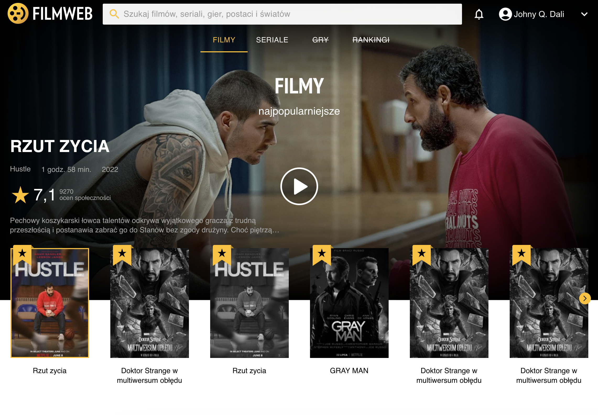

# Filmweb

## General info

Project created from scratch without online courses, imitating the filmweb.pl
website. I tried to use the Pixel Perfect technique, reproducing the page as
accurately as possible. Only the movies and series section was created.

## Technologies

- ReactJS 18.2 & Context & hooks
- Formik 2.2 & Yup
- MaterialUI 5.8
- SCSS
- API - Firebase 9.10

## Website

[https://dulcet-lamington-5e2872.netlify.app](https://dulcet-lamington-5e2872.netlify.app)

## Features

- Browse movies and series that are downloaded from the database (firebase)
- Adding to favorite movies or series
- Search engine for movies and series
- User login and registration
- Changing the user profile (nick, e-mail, password)

## Illustrations

